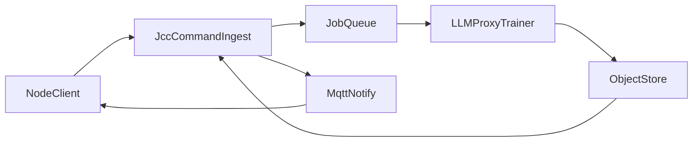

# JCC Local Adapter Training (3B) PRD

## Summary
Train per-node LoRA adapters on a central GPU host (llm-proxy) whenever node commands change. JCC ingests command schemas, enqueues training jobs via the llm-proxy job queue, receives the adapter artifact in an object store (S3/MinIO), and notifies nodes over MQTT with a signed download URL.

This is intended as the primary path for custom commands (prompt injection remains a fallback).

## Goals
- Provide reliable custom command routing/parameter extraction for 3B models.
- Keep training on local GPU (3080/3090) with acceptable latency (15–20 minutes per update).
- Support multi-tenant nodes with isolated datasets and artifacts.
- Allow nodes to use their llm-proxy selected base model for adapter targeting.

## Non-Goals
- Full model fine-tuning per node.
- Long-term artifact hosting beyond short retention.
- Real-time training on every utterance.

## Scope
- JCC API for command ingest and job status.
- llm-proxy training worker integration (via existing job queue endpoint).
- Dataset construction based on `IJarvisCommand` schema.
- Artifact storage via S3/MinIO with TTL cleanup.
- MQTT notification to nodes.

## Architecture Overview



## Data Sources
Nodes generate command schemas using `IJarvisCommand.get_command_schema()` and send:
- command_name, description, rules, critical_rules
- parameters (types, required, enum)
- examples (primary + secondary)
- antipatterns

## Schema Validation
JCC should validate `command_schema[]` on ingest and return **400** with a structured error list.

Validation rules (baseline):
- Required fields present and types correct.
- `command_name` unique across the payload.
- `parameters[].name` unique per command.
- `examples` count within bounds (e.g., 1–20).
- Primary example count ≤ 1.
- `expected_parameters` keys ⊆ parameter names.

Example error response:
```json
{
  "error": "invalid_schema",
  "details": [
    {"path": "commands[3].examples[0]", "code": "missing_field", "message": "voice_command required"},
    {"path": "commands[1].parameters[2].type", "code": "invalid_type", "message": "unknown param type: array<float>"},
    {"path": "commands[5].examples", "code": "too_few_examples", "message": "minimum 1 example required"}
  ]
}
```

## Training Triggers
Trigger training on **every command change**:
- Add / update / delete a command.
- The node posts the updated command schema list to JCC.
- JCC enqueues a training job for llm-proxy.

## Training Pipeline
1. **Dataset assembly** (JCC):
   - Build instruction pairs from examples and schema.
   - Include negative examples from `antipatterns` and confusion pairs.
   - Render relative dates using date context into absolute ISO-8601.
2. **Training** (llm-proxy):
   - Target base model = node’s current llm-proxy selected model.
   - LoRA rank and epoch defaults tuned for 15–20 minutes per update.
3. **Artifact publish** (llm-proxy):
   - Upload adapter to S3/MinIO.
   - Return artifact URL + metadata to JCC.
4. **Notification** (JCC → node):
   - Publish MQTT event with signed URL + metadata.
   - Node downloads and activates adapter.

## Dataset Format (Draft)
Each example becomes a supervised pair:
- **Input**: system prompt + tool list + user utterance
- **Output**: tool call JSON (name + arguments)

Suggested minimum:
- 5–15 examples per command (1 primary + 4–14 secondary).
- 2–5 negative/antipattern examples per command.
Maximum dataset size:
- **2000 total examples** per job (roughly 200 commands × 10 examples).

## API Surface (Draft)

### JCC
`POST /api/v0/adapters/train`
- Input:
  - `node_id`
  - `base_model_id`
  - `command_schema[]`
  - `dataset_hash` (optional)
- Output:
  - `job_id`
  - `status`

`GET /api/v0/adapters/jobs/{job_id}`
- Output:
  - `status` (`queued`, `running`, `complete`, `failed`)
  - `progress` (optional)
  - `artifact_url` (signed, if complete)
  - `artifact_metadata`

`POST /api/v0/adapters/jobs/{job_id}/cancel`
- Output:
  - `status` (`canceled`)

### llm-proxy
`POST /llm-proxy/jobs/queue`
- Input:
  - `job_type`: `adapter_train`
  - `node_id`
  - `base_model_id`
  - `dataset_ref` (inline payload; first iteration)
  - `params` (rank, epochs, batch size, max_seq_len)
- Output: `job_id`

`POST /llm-proxy/jobs/{job_id}/cancel`
- Output: `status` (`canceled`)

Auth for llm-proxy queue/cancel endpoints:
- Jarvis app-to-app auth (same as chat endpoints).

## Job Queue & Coalescing
- Single active training job per node.
- If new changes arrive while training:
  - coalesce into a new job and cancel/mark stale the previous job.
  - keep the most recent dataset snapshot.
- Jobs should be **idempotent by `dataset_hash`** and skip retraining when unchanged.
- If `base_model_id` changes during training: treat as out-of-scope for now; no automatic cancel/requeue.

## Artifact Storage
- Store in S3/MinIO with:
  - `node_id`, `base_model_id`, `dataset_hash`, `created_at`.
- Signed URL TTL (e.g., 48 hours).
- Signed URLs are **reusable until TTL** (not one-time).
- Cleanup:
  - Delete after download or after TTL.
- Object store configuration is read from environment variables.
- The interface must be identical for S3 and MinIO.

## Adapter Format
- **PEFT LoRA adapter weights** (diff format) are the standard output.
- llm-proxy handles loading the LoRA adapter on top of the node’s base model.
- If needed, llm-proxy may convert to backend-specific formats at load time.

## Base Model Identifiers
- `base_model_id` is provided by llm-proxy and reflects the **currently configured** model for that node.
- llm-proxy maps `base_model_id` to an HF repo or local path.
- JCC treats `base_model_id` as an opaque identifier and passes it through unchanged.

## MQTT Notification
Publish `adapter_ready` event to node:
```json
{
  "node_id": "node-123",
  "base_model_id": "llm-proxy-model-name",
  "adapter_url": "https://...",
  "dataset_hash": "abc123",
  "created_at": "2026-01-18T04:00:00Z"
}
```

## Multi-Tenant Controls
- Auth required for ingest and status.
- Rate limits per node (max jobs/hour).
- Size limits for dataset and artifact.
- Signed URLs scoped to node.

## Quality Gate (Publish Criteria)
Before publishing an adapter:
- Run a lightweight eval on a small holdout split (e.g., 10% of examples).
- Require minimum **exact tool name match** and **required-parameter presence** rate (default target: **≥80%**).
- If gate fails: mark job as `failed` and do not publish artifact.
- Thresholds are configurable per environment.

## Performance Targets
- Local GPU (3080/3090): **15–20 minutes** per update.
- Typical dataset size: 5–15 examples per command.
- Small LoRA rank to minimize training time and adapter size.

## Runtime Adapter Application & Latency
### vLLM
- **Per-request adapter selection** with adapter caching.
- When adapter is cached: **single-digit to tens of ms** overhead.
- First load of a new adapter: **hundreds of ms to a couple seconds** (disk → GPU).
- Concurrency limit controlled by env var (default **1**) for adapter-loaded request slots.
- Cache size (number of adapters kept in memory) is configurable via env var.

### llama.cpp
- No native adapter multiplexing; per-request swap is expensive.
- Expect **100ms–1s+** overhead for adapter swap if not cached in-memory.
- Recommended: **small pool** of adapter-loaded model instances or strict cache limits.
- Concurrency limit is configurable via env var, default **1**.

## Risks & Mitigations
- **Noisy examples**: validate examples; reject if empty/invalid.
- **Model drift**: train adapters per base model id.
- **Job spam**: coalescing + rate limiting.
- **Artifact leaks**: signed URLs + TTL + access checks.

## Retry & Failure Handling
- If **artifact upload fails**:
  - Cache adapter on disk and retry every **5 minutes** for **1 hour**.
  - In dev: keep cached file indefinitely.
  - After 1 hour (non-dev): delete cached file and mark job failed.
- If **MQTT notify fails**:
  - Retry notify with exponential backoff; do not retrain.

## Open Questions
- None.